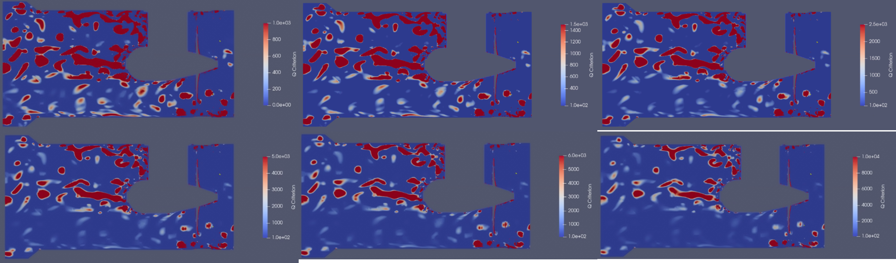
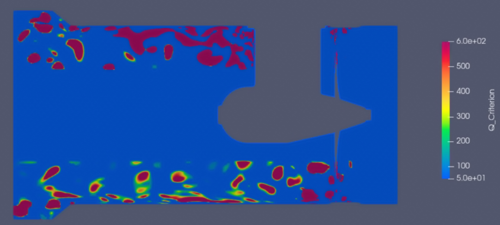
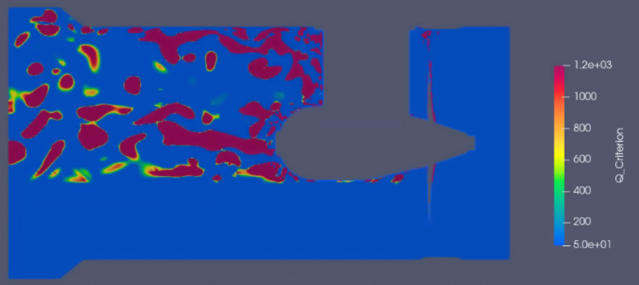
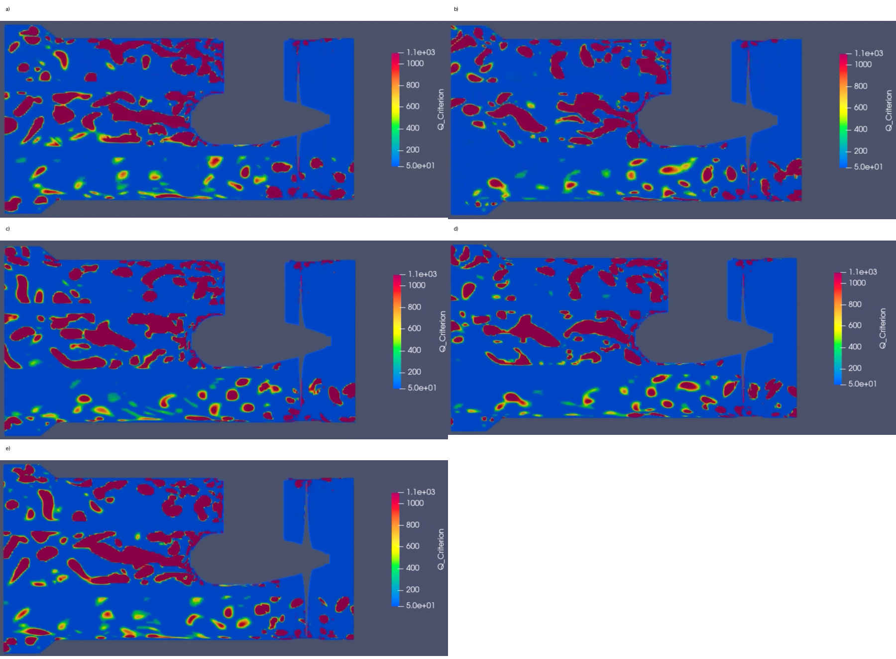
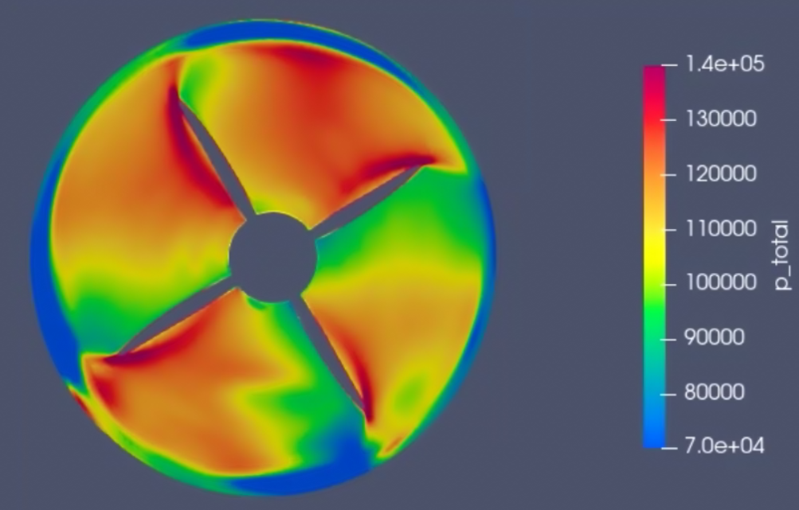
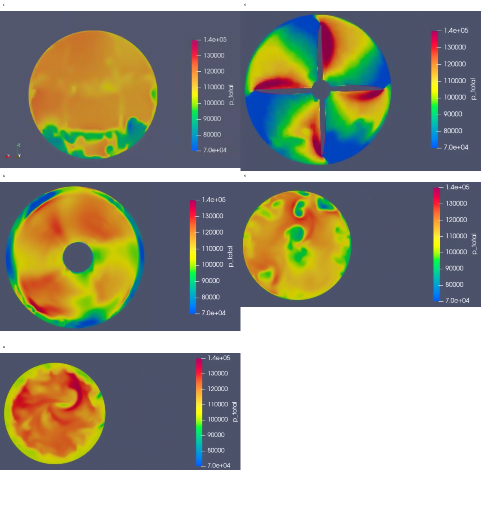

# Automated Bow-Thruster CFD Post-Processing with Python & ParaView

Automated post-processing and scientific visualization workflow for an existing OpenFOAM bow-thruster CFD simulation using **Python and ParaView**.

The project focuses on **Q-criterion vortex visualization, transient flow analysis, total-pressure calculation, and automated moving-slice visualization**, with an emphasis on reproducibility and consistent visualization settings.

---

## Project Overview

CFD post-processing can involve repetitive operations such as loading transient results, applying filters, defining slices, adjusting visualization ranges, configuring cameras, and exporting results.

This project uses Python scripting in ParaView to automate these operations for an existing bow-thruster OpenFOAM dataset.

The workflow was developed to investigate:

- blade-tip vortex structures;
- hub and junction vortex structures;
- transient evolution of the visible Q-criterion field;
- total-pressure distribution; and
- pressure-field variation using an automated moving slice.

The underlying CFD simulation itself is not included in this repository.

---

## Tools & Technologies

- **Python**
- **ParaView**
- **ParaView Python API**
- **OpenFOAM CFD data**
- **NumPy**
- **Scientific Visualization**
- **CFD Post-Processing**

---

## Processing Workflow

The project follows a staged post-processing workflow:

```text
Existing OpenFOAM CFD Results
            |
            v
      ParaView Reader
            |
            v
   Geometry / Domain Clipping
            |
            +-----------------------------+
            |                             |
            v                             v
     Q-Criterion Path              Pressure Path
            |                             |
            v                             v
     Gradient Filter               Total Pressure
            |                      Calculation
            v                             |
      X-Normal Slice                      v
            |                       Y-Normal Slice
            v                             |
      Spatial Mask                        v
            |                     Moving Slice Track
            v                             |
   Fixed Visualization                    v
        Settings                   Fixed Visualization
            |                          Settings
            v                             |
    Transient Analysis                    v
            |                        Animation
            v
       Results / Images
```

---

## Source Code

The automated post-processing workflow is implemented using three main Python/ParaView scripts.

### `Task3-4_Q_Range.py`

Single-time-step Q-criterion visualization workflow using calibrated display settings for the blade-tip, hub/junction, and combined regions.

Selected Q display ranges:

| Region | Q Display Range |
|---|---:|
| Blade-tip | 50–600 |
| Hub / junction | 50–1200 |
| Combined | 50–1100 |

### `tip_hub_pipeline_final.py`

Transient combined blade-tip and hub/junction Q-criterion workflow.

Main visualization settings:

- Q display range: **50–1100**
- visualization-suppression threshold: **Q = 550**
- X-normal slice
- Y-Z visualization plane
- fixed camera
- fixed colour range
- consistent spatial-selection logic

> **Note:** Q = 550 is used as a visualization-suppression threshold for visual clarity. It is not treated as a universal physical vortex boundary or as a numerically validated noise threshold.

### `pressure_moving_slice.py`

Automated total-pressure and moving-slice visualization workflow.

The script calculates total pressure and moves a Y-normal X-Z slice through the CFD domain while the transient CFD solution advances.

➡️ [View the Python source files](src/)

---

# CFD Visualization Results

## 1. Q-Criterion Range Calibration

Before the transient visualization was created, different Q-criterion display ranges were compared.

The objective was to establish consistent visualization settings instead of relying only on automatic colour rescaling.



The selected ranges were:

- **Blade-tip:** Q = 50–600
- **Hub / junction:** Q = 50–1200
- **Combined:** Q = 50–1100

---

## 2. Blade-Tip Vortex Visualization

The blade-tip region was examined using the Q-criterion to visualize rotation-dominated structures around the propeller-tip region.

Selected display range:

**Q = 50–600**



---

## 3. Hub and Junction Vortex Visualization

The central hub and junction region was examined separately to visualize Q-criterion structures around the bow-thruster assembly.

Selected display range:

**Q = 50–1200**



---

## 4. Transient Q-Criterion Analysis

The combined tip-and-hub configuration was extended across the available CFD time steps.

The transient visualization uses:

**Q display range = 50–1100**

with a separate visualization-suppression threshold of:

**Q = 550**

The slice orientation, spatial-selection logic, camera configuration, and colour range are kept consistent throughout the sequence.

This makes qualitative comparison between representative transient frames more meaningful.



The frames represent different CFD time steps from the same automated processing pipeline rather than independently configured visualizations.

---

## 5. Total-Pressure Analysis

Total pressure is calculated from the supplied pressure and velocity fields using:

**p_total = p + 0.5 ρ |U|²**

where:

**ρ = 1025 kg/m³**

The visualization uses a fixed total-pressure display range of:

**70–140 kPa**



This provides a complementary visualization of the flow field alongside the Q-criterion analysis.

---

## 6. Automated Moving Total-Pressure Slice

A Y-normal X-Z slice is automatically moved through the CFD domain from:

**Y = +0.3 m → Y = -1.5 m**

The flow direction is toward **-Y**.



The slice position and CFD solution time change together during the animation.

Therefore, the sequence contains both **spatial and temporal variation** and should be interpreted as an automated visualization sweep rather than as a wake-tracking algorithm.

➡️ [View animation results and technical settings](results/)

---

## Automation Approach

Instead of manually rebuilding the ParaView pipeline for every visualization, the Python scripts define the important processing and visualization parameters programmatically.

The automated workflow includes:

- loading OpenFOAM results;
- selecting relevant mesh regions;
- restricting the working CFD domain;
- calculating Q-criterion from the velocity field;
- defining cross-sectional slices;
- applying spatial masks;
- controlling visualization thresholds;
- fixing colour-transfer ranges;
- maintaining consistent camera settings;
- calculating total pressure;
- animating a moving pressure slice; and
- processing transient CFD states consistently.

This improves **repeatability, parameter traceability, and visualization consistency** compared with repeatedly configuring the workflow manually.

---

## Repository Structure

```text
bow-thruster-cfd-postprocessing-using-python-paraview/
│
├── README.md
├── .gitignore
│
├── src/
│   ├── README.md
│   ├── Task3-4_Q_Range.py
│   ├── tip_hub_pipeline_final.py
│   └── pressure_moving_slice.py
│
├── images/
│   ├── README.md
│   ├── q_range_calibration.png
│   ├── tip_vortex.png
│   ├── hub_junction_vortex.png
│   ├── transient_q_frames.png
│   ├── total_pressure.png
│   └── moving_pressure_slices.png
│
├── results/
│   └── README.md
│
└── docs/
    └── README.md
```

> Animation files, when included, are stored in the `results/` directory.

---

## Engineering Interpretation

The project demonstrates how scripted post-processing can make CFD visualization workflows more systematic and reproducible.

The Q-criterion workflow provides a method for examining rotation-dominated structures in selected blade-tip and hub/junction regions.

The transient workflow applies the same visualization configuration across multiple CFD time steps, allowing visible changes in the retained Q-criterion structures to be compared consistently.

The total-pressure workflow provides a second perspective on the flow field by combining the supplied static-pressure field with the local velocity contribution.

The moving slice extends this analysis across different locations through the domain.

---

## Scope & Limitations

This project focuses on **CFD post-processing, automation, and scientific visualization**.

The underlying OpenFOAM simulation was supplied separately and is not included in this repository.

The work should not be interpreted as:

- a mesh-independence study;
- solver validation;
- turbulence-model validation;
- direct cavitation prediction;
- acoustic prediction; or
- complete three-dimensional vortex tracking.

Q display limits, spatial masks, and suppression thresholds are visualization choices and require engineering judgement.

A visually clear CFD result should not by itself be interpreted as numerical or physical validation of the underlying simulation.

---

## Skills Demonstrated

### CFD & Computational Engineering

- CFD post-processing
- transient-flow visualization
- Q-criterion vortex visualization
- total-pressure analysis
- interpretation of CFD field data

### Python & Engineering Automation

- Python scripting
- ParaView Python automation
- parameterized post-processing workflows
- programmable filtering
- transient visualization automation
- moving-slice animation

### Scientific Visualization

- consistent colour-range control
- spatial filtering
- cross-sectional flow visualization
- camera standardization
- transient result comparison
- engineering visualization

### Engineering Workflow Development

- reproducible analysis workflows
- parameter traceability
- automation of repetitive engineering tasks
- technical documentation
- result interpretation with documented limitations

---

## Documentation

Additional project documentation is available in the [`docs`](docs/) directory.

The original academic report and presentation are not included in this public repository because they contain personal, academic, and administrative information.

---

## Project Context

This project was completed as part of a university Software Lab and focuses on applying **Python automation and ParaView scripting to CFD post-processing**.

The repository has been organized as a technical portfolio project highlighting the computational engineering workflow, source code, visualization results, and reproducibility of the post-processing process.
